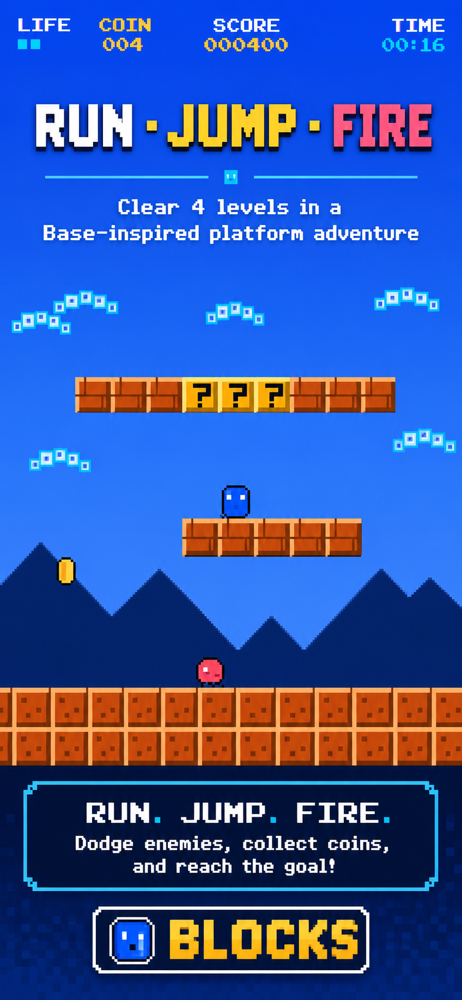
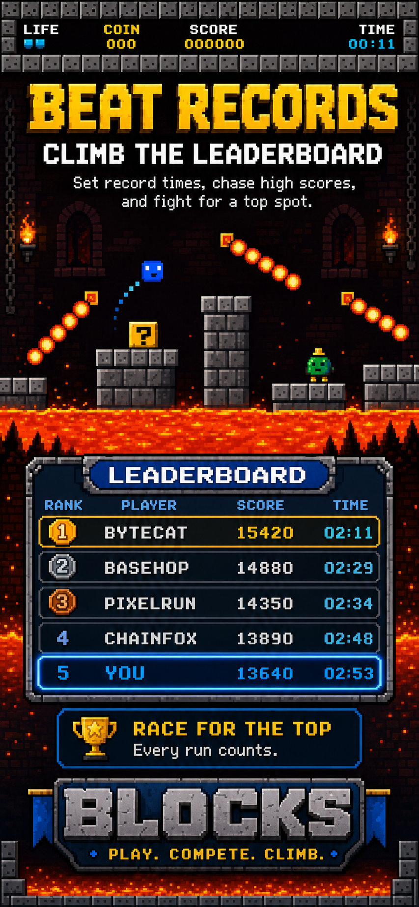
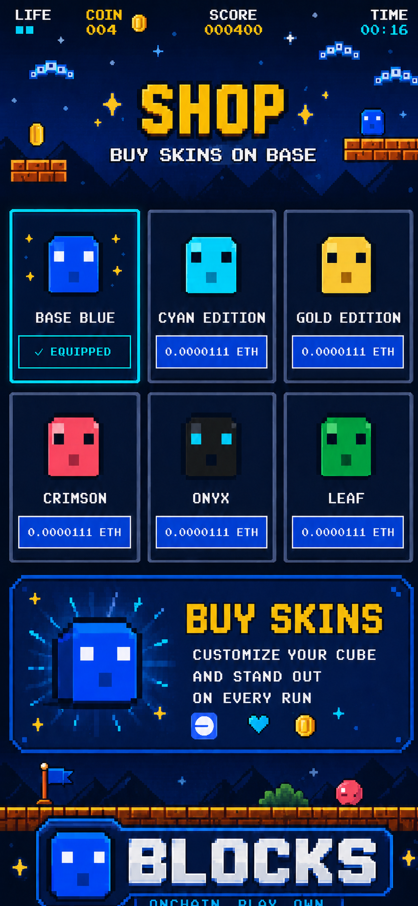

# BLOCKS

[](https://github.com/blessedunit/blocks-base/actions/workflows/ci.yml)
[](LICENSE)
[](https://basescan.org/address/0xca00c5470caf234a0ad9bc495e71d680125386ed)

Crunchy 8-bit side-scrolling platformer on **Base**. Run, jump, stomp, fire — 16 stages of pipes, lava and one very angry boss.

**▶ Play:** https://blocks-base.vercel.app



## Features

- 4 worlds × 4 stages — overworld, underground, sky bridges, castle with a boss fight
- Classic power-up chain: mushroom → super (breaks bricks) → fire flower (bouncing fireballs)
- Stomps, shell kicks, invincibility stars, secret coin blocks, speedrun timer
- Procedural chiptune soundtrack — 4 themes rendered live with Web Audio, no audio files
- Original pixel art: every sprite is drawn in code (no external assets)
- Built for one-handed phones: touch D-pad + HOP + RUN/FIRE, integer-scaled crisp pixels, safe-area aware
- Keyboard support on desktop: arrows/WASD + Space + Shift/X/Z

## Controls

| Action | Touch | Keyboard |
|---|---|---|
| Move | ◀ ▶ D-pad | ← → / A D |
| Jump (hold = higher) | HOP | Space / ↑ / W |
| Crouch | ▼ | ↓ / S |
| Sprint / Fireball | RUN/FIRE | Shift / X / Z |
| Pause | ⏸ button | Esc / P |

## Onchain (Base mainnet, 8453)

Optional — the game is fully playable without a wallet and gracefully degrades to localStorage.

| Contract | Address | Purpose |
|---|---|---|
| `BlocksRun` | [`0xca00c5470caf234a0ad9bc495e71d680125386ed`](https://basescan.org/address/0xca00c5470caf234a0ad9bc495e71d680125386ed) | `recordRun(score, timeMs, levelsCleared)` — global leaderboard (SCORE + TIME tabs) |
| `BlocksSkin` | [`0x2bb2ac4a4f568bb66150ee292792d14e52f8843b`](https://basescan.org/address/0x2bb2ac4a4f568bb66150ee292792d14e52f8843b) | `mintSkin(uint8)` — skin shop at 0.0000111 ETH |
| `BlocksDaily` | [`0x77cd92cc91cb95abe40329ff1f285284644cd060`](https://basescan.org/address/0x77cd92cc91cb95abe40329ff1f285284644cd060) | `recordDailyRun(...)` — per-day challenge ranking |

The leaderboard is read straight from `RunRecorded` events (chunked `getLogs`), no backend anywhere — the whole game is a static site plus three small contracts.

## Tech

- **App:** React 19 · Vite 6 · TypeScript · Tailwind v4
- **Rendering:** Canvas 2D at a logical 320×224, integer-scaled letterbox (crisp pixels on any screen)
- **Physics:** tilemap AABB collision, axis-separated sweeps, coyote time + jump buffering
- **Wallet:** wagmi 2 + viem + ConnectKit, Base mainnet only
- **Contracts:** three dependency-free Solidity contracts, compiled and deployed with a single `viem` script (`contracts/deploy.mjs`)

## Repo layout

```
source/     game client (React + canvas engine)
contracts/  Solidity sources + deploy script + deployed addresses/ABIs
docs/       screenshots
```

## Run locally

```bash
cd source
npm install
npm run dev
```

Onchain features are off by default. To point the client at the live contracts:

```bash
VITE_USE_CONTRACT=true
VITE_CONTRACT_ADDRESS=0xca00c5470caf234a0ad9bc495e71d680125386ed
VITE_DEPLOY_BLOCK=46331864
VITE_SKIN_ADDRESS=0x2bb2ac4a4f568bb66150ee292792d14e52f8843b
VITE_SKIN_DEPLOY_BLOCK=46331865
VITE_DAILY_ADDRESS=0x77cd92cc91cb95abe40329ff1f285284644cd060
VITE_DAILY_DEPLOY_BLOCK=46331866
```

## Deploy contracts

```bash
cd contracts
npm install
PRIVATE_KEY=0x... node deploy.mjs   # writes deployed.json with addresses + ABIs
```

## Screenshots

| | | |
|---|---|---|
|  |  |  |

## License

MIT
